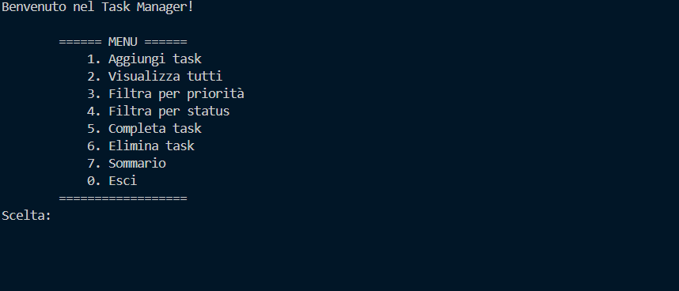

# 🗂️ Java Console Task Manager



Un semplice **Task Manager da console sviluppato in Java** che permette di creare, gestire e monitorare attività (task) con priorità e stato.

Questo progetto è stato realizzato per esercitarsi con i concetti fondamentali della programmazione Java come **OOP, ENUM, Stream API e architettura a livelli (Model-Service)**.

---

# 🚀 Funzionalità

* ✅ Creazione di nuove task
* 📋 Visualizzazione di tutte le task
* 🔎 Filtro per **priorità**
* 🔎 Filtro per **stato**
* ✔️ Completamento di una task
* ❌ Eliminazione di una task
* 📊 Sommario delle task (TODO / IN_PROGRESS / DONE)

---

# 📷 Screenshot


---

# 🧠 Tecnologie utilizzate

* **Java 17+**
* **Stream API**
* **OOP (Object Oriented Programming)**
* **Enum**
* **Maven**

---

# 📁 Struttura del progetto

```
src
 └─ main
     └─ java
         └─ com.taskmanager
             ├─ Main.java
             ├─ model
             │   ├─ Task.java
             │   ├─ Priority.java
             │   └─ TaskStatus.java
             └─ service
                 ├─ TaskService.java
                 └─ TaskServiceImpl.java
```

**model**

Contiene le classi che rappresentano i dati dell'applicazione.

* `Task`
* `Priority`
* `TaskStatus`

**service**

Contiene la logica di gestione delle task.

* `TaskService` → interfaccia
* `TaskServiceImpl` → implementazione

**Main**

Punto di ingresso dell'applicazione e gestione del menu da console.

---

# ▶️ Come eseguire il progetto

### Metodo 1 – VS Code / IDE

1. Aprire il progetto
2. Aprire il file:

```
Main.java
```

3. Premere **Run** sul metodo `main()`.

---

### Metodo 2 – Terminale

Compilare il progetto:

```
mvn compile
```

Eseguire l'applicazione:

```
mvn exec:java -Dexec.mainClass="com.taskmanager.Main"
```

---

# 💻 Esempio di utilizzo

Quando il programma viene avviato viene mostrato il menu:

```
====== MENU ======
1. Aggiungi task
2. Visualizza tutti
3. Filtra per priorità
4. Filtra per status
5. Completa task
6. Elimina task
7. Sommario
0. Esci
==================
```

Esempio di creazione task:

```
Titolo: Studiare Java
Descrizione: Ripassare Stream API
Priorità: HIGH
```

---

# 📊 Stati delle task

| Stato       | Descrizione         |
| ----------- | ------------------- |
| TODO        | Task da iniziare    |
| IN_PROGRESS | Task in lavorazione |
| DONE        | Task completata     |

---

# 🎯 Obiettivo del progetto

Questo progetto è stato realizzato per:

* praticare **Java OOP**
* utilizzare **Stream API**
* imparare a strutturare un piccolo progetto Java
* simulare una **semplice applicazione gestionale**

---

# 🔮 Possibili miglioramenti futuri

* Salvataggio delle task su **file JSON**
* Persistenza con **database**
* Creazione di una **REST API con Spring Boot**
* Interfaccia grafica

---

# 👨‍💻 Autore

Progetto realizzato da **Luca** come esercizio di pratica Java.
